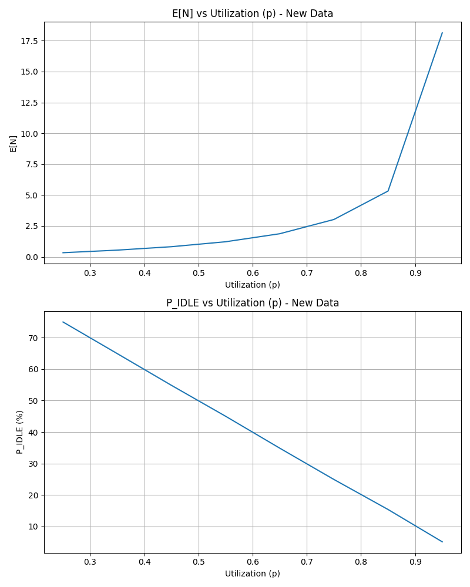
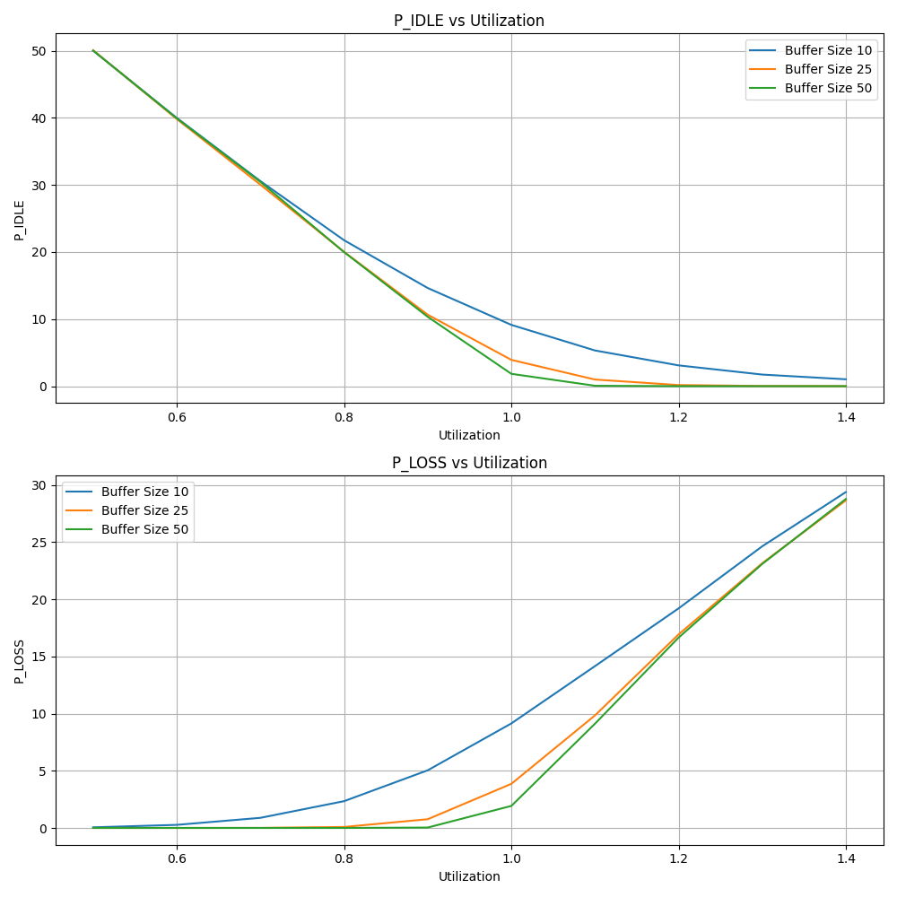

# Networking-Labs

## Question 1
*Write a Python function that receives λ as one of its arguments and that returns a single random sample
drawn from an exponential random distribution. Using this function, write a short piece of Python code
to generate 1000 exponential random variables with λ=75. What is the mean and variance of the 1000
random variables you generated? Do they agree with the expected value and the variance of an
exponential random variable with λ=75? Your values will not be exact. Why not? Note: if you do not
know what you are expecting to see, you will need to look it up.*

| **Statistic** | **Computed Value**       | **Expected Value**        |
|---------------|---------------------------|---------------------------|
| Mean          | 0.0133048956165309        | 0.0133333333333333        |
| Variance      | 0.0001716209800562        | 0.0001777777777778        |

My implementation does match the expected value since we know from probability theory that the expected value of an expoential random variable is $\frac{1}{\lambda}$. Our $\lambda = 75$ so the expected value is $\frac{1}{75} = 0.0133$ 

They can't be exact because we are running a finite amount of experiments on a random variables. As we increase
the number of experiments we can got close the theoretical expected and variance but will never be able to truly reach it.

## Question 2
*Build your simulator for an M/M/1. Explain in words how you compute the performance metrics E[N] and
PIDLE. Do not show code.*

1. To compute E[N], the simulator needs to keep count of two variables: the total number of packets in the queue and the number of observers. Since the observer events happened much faster than the arrival/departure events, we can use those times to examine the average load on the queue accurately. During each observer event, the simulator adds the current packets in the queue to the total number of packets. Dividing the sum by the number of times it has been counted (number of observer events) will give the average queue size.

2. To compute PIDLE, the simulator needs to keep track of its total time idling and divide it by the length of the simulation. During the simulation, when a packet arrival occurs, the simulator checks if the queue was previously empty. If empty, it simply subtracts the current time from the last departure.  

## Question 3
*The packet length will follow an exponential distribution with an average of L = 2000 bits. Assume that C
= 1Mbps. Use your simulator to obtain the following graphs. Plot them on separate figures.

1. *E[N], the average number of packets in the queue as a function of ρ (for 0.25 < ρ < 0.95, step size 0.1).* 

2. *PIDLE, the proportion of time the system is idle as a function of ρ (for 0.25 < ρ < 0.95, step size 0.1).*

*Explain the trends in both graphs*

1. As the queue utilization (ρ) increases, the trend for the average increases (reciprocally). This is because even though the queue is infinite, there is a finite amount of time to process each packet, and only one packet can be processed at a time. When a new packet arrives before the last packet has finished, that fills up our queue. The expected value of the time to process a packet can be represented as $\frac{E\left(\frac{1}{L}\right)}{C} = \frac{L}{C}$ and the expected difference of the arrival time is $E\left(\frac{\rho \cdot C}{L}\right) = \frac{L}{C \rho}$. We can see mathematically that, on average, the queue packets will arrive after they can be serviced by a factor of $1/\rho$, which is why we see a reciprocal relation as $\rho$ approaches $1$. 

2. As the queue utilization ($\rho$) increases, the trend for the amount of idle queue time decreases linearly. Since the time spent idling is max{next arrival (ai+1) - (current arrival (ai) + service time (s), 0)} which we can simplify, this by assuming the current arrival happens at t=0, and with a bit of math we find 

$$ = max(\frac{L}{C}\rho - \frac{L}{C \rho}, 0) $$
$$ = max(\frac{L(p-1)}{Cp}, 0) $$
$$ = max(\frac{-L(1-p)}{Cp}, 0) $$

which shows why we get the negative linear relation. 

## Question 4

*For the same parameters, simulate for ρ=1.2. What do you observe? Explain.*

Since $\rho > 1$ the queue will fill faster than it is able to empty itself. This means that as time increases, the queue will never empty and will get larager and larger. Mathamically this is becuase of the $\frac{1}{\rho}$ relation.

## Question 5

*Build a simulator for an M/M/1/K queue and briefly explain how you implemented packet dropping. Explain in words how you computed PLOSS. Do not show code.*

Since I store the events in a priority queue and pop the most recent events repeatedly, I only need to increment the queue when an arrival event happens and decrement it when a departure event occurs. Now that we know the queue length, all the simulator has to do is during an arrival; if the queue length is larger than the buffer size, drop the packet and increment the count. To calculate PLOSS, we need to divide this drop count by the number of arrivals.

## Question 6
*Let L=2000 bits and C=1 Mbps. Use your simulator to obtain the following graphs:*
- *PIDLE as a function of ρ (for 0.5 < ρ < 1.5, step size 0.1), for K = 10, 25, 50 packets. Show one curve for each value of K on the same graph.*
- *PLOSS as a function of ρ (for 0.5 < ρ < 1.5) for K = 10, 25, 50 packets. Show one curve for eac value of K on the same graph.*
*For which value of K does PIDLE reach zero soonest? Why is this the case?*

PIDLE reaches zero the soonest when the queue is the largest. This is because buffer size is inversely proportional to PLOSS. As the queue fills up, smaller queues will drop packets more frequently. Smaller queues can quickly empty their buffers when there is a large gap between arrivals. However, more enormous queues have more capacity and take longer to empty, resulting in less idle time.
